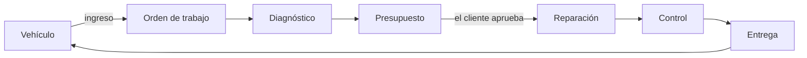
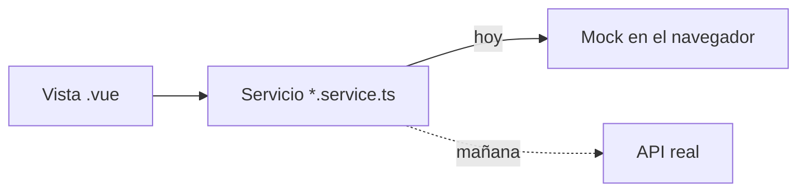

# KM.Taller · Torque

[](https://github.com/Kreyshin/KM.WEB.TALLER.AUTO/actions/workflows/pages.yml)

Back office para taller mecánico: órdenes de trabajo, bahías, presupuestos, repuestos, baremos de mano de obra, citas y comprobantes. **Un sistema Karma Systems.**

| | |
| --- | --- |
| 📚 **Documentación** | [kreyshin.github.io/KM.WEB.TALLER.AUTO](https://kreyshin.github.io/KM.WEB.TALLER.AUTO/) |
| 🖥️ **Demo** | [kreyshin.github.io/KM.WEB.TALLER.AUTO/demo](https://kreyshin.github.io/KM.WEB.TALLER.AUTO/demo/) |

> La documentación es **funcional**, no técnica: explica el vocabulario, las pantallas y los procesos del taller. Para el detalle de arquitectura, el código manda.

> En la demo el acceso viene precargado y acepta cualquier contraseña. Los datos viven en tu navegador y se reinician desde **Perfil → Datos de ejemplo**.

## El ciclo de la vertical

Donde Restaurante tiene **mesa → comanda → KDS** y Hospedaje **habitación → reserva → estancia**, un taller tiene **vehículo → orden de trabajo → entrega**, con una persona que tiene que decir que sí en medio:



La decisión de diseño que gobierna todo el modelo: **una orden tiene dos dimensiones vivas e independientes**.

| Dimensión | Qué dice | Valores |
| --- | --- | --- |
| **Fase** | En qué punto va el trabajo | recepción · diagnóstico · presupuesto · reparación · control · lista · entregada |
| **Detención** | Si avanza o no, y por qué | espera aprobación · espera repuesto · espera al cliente · espera a un tercero |

Una orden puede estar **en reparación y detenida** esperando un repuesto: sigue en reparación —ahí volverá cuando llegue la pieza— pero no avanza, y ese tiempo no cuenta como trabajo. Colapsarlas en un único estado es el error clásico del dominio; aquí se evita por tipos.

## Enfoque: front primero

El back office se construye completo **sobre datos de ejemplo**, antes que el backend. La regla que lo hace posible:



- Las vistas **nunca** leen datos directamente: siempre llaman a un servicio.
- Cambiar el mock por la API solo toca el servicio; las vistas no cambian.
- Los tipos de `src/types` son el borrador del **modelo de datos** del backend.

## Stack

Vue 3 + TypeScript · Vite · Pinia · Vue Router · Tailwind CSS v4 · Vitest · Testing Library

## Empezar

Requisitos: **Node 24** o superior.

```bash
cd backoffice
npm install
npm run dev        # app en http://localhost:5173
npm run docs:dev   # documentación en local
```

| Script | Qué hace |
| --- | --- |
| `npm run dev` | Servidor de desarrollo |
| `npm run verify` | Formato, lint, tipos y pruebas. **Debe pasar antes de cada commit** |
| `npm run build` | Build de producción |
| `npm run build:demo` | Build de la demo para GitHub Pages |
| `npm run docs:build` | Build de la documentación |

### Cuentas de prueba

| Correo | Rol | Qué ve |
| --- | --- | --- |
| `admin@torqueautos.pe` | Administrador | Todo |
| `patricia@torqueautos.pe` | Asesor de servicio | Órdenes, clientes, citas, catálogo, facturación |
| `oscar@torqueautos.pe` | Técnico | Tablero, órdenes, carga, vehículos |
| `elmer@torqueautos.pe` | Almacén | Tablero, repuestos, movimientos |

## Estructura

```text
.
├─ .github/workflows/pages.yml   Publica documentación y demo en GitHub Pages
└─ backoffice/
   ├─ docs/                      Documentación funcional (VitePress)
   └─ src/
      ├─ assets/                 Sistema de diseño (main.css) e identidad Karma
      ├─ components/
      │  ├─ layout/              Shell: barra de módulos, menú de secciones, cabecera
      │  ├─ marca/               Isotipos: Torque (vertical) y Karma Novum (plataforma)
      │  ├─ ordenes/             Ficha de orden de trabajo
      │  └─ ui/                  Kit Km*: tabla, catálogo, drawer, campos, estados
      ├─ composables/            useListado (tabla paginada), useAcceso, useConfirmarEstado
      ├─ config/marca.ts         Nombre, lema y capacidades de la vertical
      ├─ layouts/AppLayout.vue   Dos barras laterales + área de trabajo
      ├─ router/                 Rutas con guardas por rol
      ├─ services/               Un servicio por dominio + motor mock
      ├─ stores/                 auth, sede activa y UI (tema, toasts, menús)
      ├─ types/                  Modelo de dominio y tipos de UI
      ├─ utils/                  Formato, fechas, validaciones, mapas de estado
      └─ views/                  Una carpeta por módulo de navegación
```

## Identidad visual

Misma **estructura** que el resto de verticales Karma —barra de módulos de 92 px, menú de secciones flotante de 300 px, área de trabajo— y **voz propia**:

| | Restaurante | Hotelería | Taller |
| --- | --- | --- | --- |
| Paleta | Naranja fuego, grafito, plata | Turquesa → azul, plata | Azul marino, acero, rojo carmín |
| Radios | 8 / 14 / 20 px | 12 / 20 / 28 px | 6 / 10 / 14 px |
| Portada | Rejilla del servicio | Franja de jornada del hotel | Parte del taller: lo parado, lo que se entrega, lo que entra |
| Acceso | Portada · Salón · Comanda | Portada · Fachada · Llave | Portada · Nave · Hoja de ingreso |
| Isotipo | Llama | Techo y cama | Capó y camino, del activo de marca |

El rojo **no es el color de acción**: es el acento de marca y el aviso de vehículo detenido. Gastarlo en cada botón lo haría invisible justo donde importa; la acción va en azul marino.

Los tokens viven en `src/assets/main.css` con el prefijo `--ts-*` y se exponen a Tailwind por `@theme inline`. La identidad de plataforma Karma se conserva íntegra en `src/assets/karma/` y sigue apareciendo como atribución.

### Postura

El tamaño de los controles no es una constante del kit: lo pone la postura desde la que se usa cada pantalla. Las pantallas de operación llevan la clase de postura de su vertical y el kit lee la escala (`--km-toque`, `--km-texto`, `--km-fila`, `--km-celda`); el resto del back office no cambia, porque quien configura catálogos está sentado en la oficina en las tres. No es «todo más grande»: Hospedaje **aprieta**, porque en un mostrador ver una noche más vale más que un botón más gordo.

## Estado

| Módulo | Estado |
| --- | --- |
| Inicio · El taller hoy | ✅ |
| Tablero de bahías en vivo | ✅ |
| Órdenes de trabajo, ficha, presupuesto y aprobación | ✅ |
| Detenidas por motivo y carga de técnicos | ✅ |
| Clientes, vehículos y citas | ✅ |
| Catálogo de servicios, baremos y planes de mantenimiento | ✅ |
| Repuestos, mínimos y movimientos | ✅ |
| Bahías, sedes, usuarios y roles | ✅ |
| Reportes de producción, facturación SUNAT, bitácora, motivos | 🚧 Ruta y permisos listos, vista pendiente |
